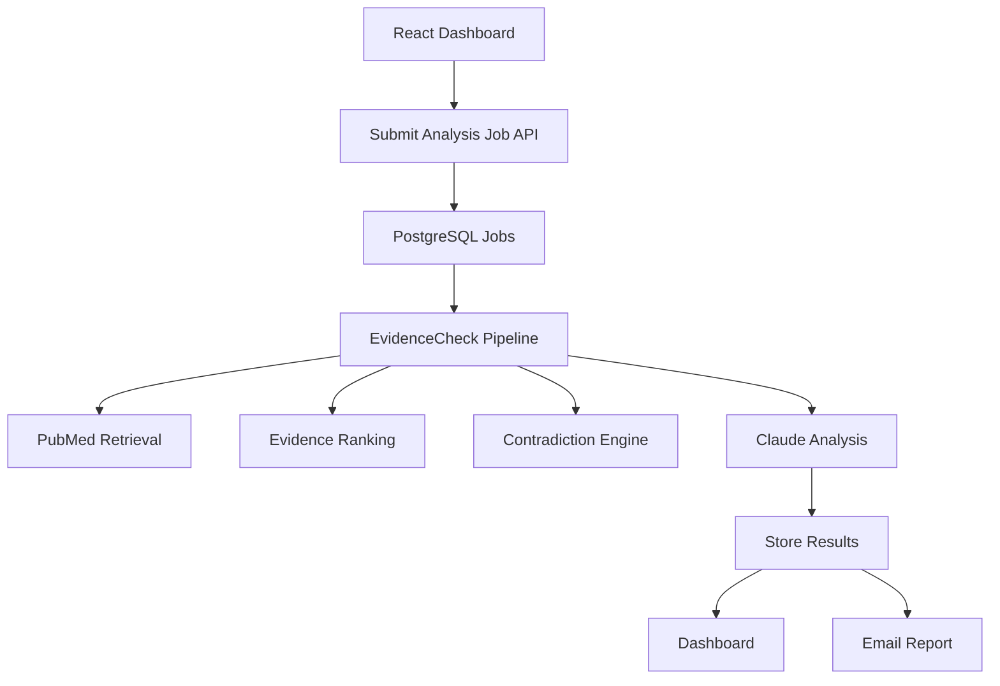

# 🧬 EvidenceCheck AI

EvidenceCheck AI is an AI-powered biomedical evidence analysis platform designed to evaluate health and nutrition claims using scientific literature retrieval, structured evidence reasoning and causal inference.

Unlike traditional AI summarization systems, EvidenceCheck builds a structured evidence model before generating conclusions. The platform retrieves PubMed literature, classifies study designs, ranks methodological quality, evaluates evidence directionality, detects contradictions, analyzes claim specificity, incorporates Bradford Hill causal signals and generates evidence-based verdicts.

Built as a real-world biomedical evidence verification platform.

[](https://n8n.io/)
[](https://anthropic.com)
[](https://pubmed.ncbi.nlm.nih.gov/)
[](https://react.dev/)
[](https://www.postgresql.org/)


[](LICENSE)

---

## 🚀 Key Features

- 🔬 Automated biomedical claim analysis
- 📚 PubMed scientific literature retrieval
- 🏆 Evidence ranking engine
- 🧬 Study design classification
- 📊 Methodological quality scoring
- ⚖️ Directionality engine (supports, contradicts, does not support)
- 🎯 Claim specificity analysis
- 📈 Weighted evidence consensus
- 🧪 Bradford Hill causal inference signals
- 🛡️ Conflict-of-interest detection
- 🚫 Anti-overstatement reasoning for absolute claims
- 🧠 Claude-powered scientific reasoning
- 📊 Interactive React dashboard
- 🗄️ PostgreSQL asynchronous job architecture
- 📧 Automated email reports

---

## 🎯 What Makes This Different?

Many AI fact-checking systems retrieve articles and ask a language model to summarize them.

EvidenceCheck introduces an intermediate evidence reasoning layer that evaluates:

- Study quality
- Evidence direction
- Consensus strength
- Claim specificity
- Potential conflicts of interest
- Causal inference signals

before generating the final verdict.

This helps reduce common issues such as:

- Treating absence of evidence as evidence against
- Confusing weak evidence with contradictory evidence
- Overstating causal conclusions
- Misclassifying absolute claims
- Ignoring differences between study designs

---

## 🌍 Potential Use Cases

* Health misinformation verification
* Nutrition claim evaluation
* Scientific fact-checking
* Biomedical research assistance
* Evidence-based decision support
* Healthcare content review
* Educational demonstrations of evidence analysis systems

---

## 🧠 Evidence Reasoning Capabilities

EvidenceCheck performs multiple layers of evidence analysis before AI reasoning:

### Evidence Retrieval

- PubMed query generation
- Claim decomposition
- Exposure and outcome extraction
- Scientific literature retrieval

### Evidence Classification

- Study design identification
- Meta-analysis detection
- Systematic review detection
- Cohort study identification
- Clinical trial classification
- Outcome tier evaluation

### Evidence Evaluation

- Methodological quality scoring
- Relevance scoring
- Exposure specificity analysis
- Claim centrality scoring
- Outcome hierarchy weighting

### Evidence Reasoning

- Directionality detection
- Contradiction analysis
- Weighted consensus generation
- Claim specificity evaluation
- Conflict-of-interest assessment
- Bradford Hill causal inference signals

### Scientific Reporting

- Evidence-based verdict generation
- Confidence estimation
- Consensus assessment
- Structured scientific explanations

---

## 🔬 Structured Evidence Reasoning Engine

EvidenceCheck does not simply summarize PubMed abstracts.

Before AI reasoning, the platform constructs a structured evidence model that includes:

- Study design classification
- Methodological quality assessment
- Relevance scoring
- Evidence directionality analysis
- Weighted consensus calculation
- Claim specificity evaluation
- Conflict-of-interest signals
- Bradford Hill causal inference signals

This architecture allows the system to distinguish between:

- Direct support
- Partial support
- Lack of support
- Contradictory evidence
- Mixed evidence
- Overgeneralized claims
- Causal overstatement
- Genuine evidence insufficiency

The objective is to reduce common failure modes observed in generic LLM-based fact-checking systems.

---

## 🏗️ System Architecture



---

## ⚙️ Core Workflows

| Workflow               | Purpose                            |
| ---------------------- | ---------------------------------- |
| Submit Analysis Job    | Creates asynchronous analysis jobs |
| EvidenceCheck Pipeline | Full biomedical evidence analysis  |
| Get Job Result         | Retrieves completed analyses       |
| List Jobs              | Dashboard job listing              |

---

## 🛠️ Technology Stack

| Technology | Purpose |
|------------|---------|
| n8n | Workflow orchestration |
| Claude | Scientific reasoning |
| PubMed | Literature retrieval |
| PostgreSQL | Asynchronous job storage |
| React | Dashboard UI |
| Vite | Frontend tooling |
| Recharts | Analytics and visualization |
| Gmail | Automated evidence reports |
| Bradford Hill Framework | Causal inference evaluation |

---

## 📂 Project Structure

```text
EvidenceCheck-AI/
│
├── README.md
├── README_ES.md
├── LICENSE
├── .env.example
│
├── workflows/
│   ├── EvidenceCheck_API_Submit_Analysis_Job.json
│   ├── EvidenceCheck_AI_Pipeline_Principal_Claude.json
│   ├── EvidenceCheck_Get_Job_Result.json
│   └── EvidenceCheck_List_Jobs.json
│
├── database/
│   └── schema.sql
│
├── dashboard/
│   ├── src/
│   ├── package.json
│   └── vite.config.js
│
└── screenshots/
    ├── dashboard-home.png
    ├── analysis-list.png
    ├── analysis-detail.png
    ├── email-report.png
    └── architecture-pipeline.png
```

---

## 🖼️ Screenshots

### Dashboard Overview


### Analysis List


### Detailed Analysis


### Email Report


### Pipeline Overview


---

## 🎥 Demo Video

A short walkthrough demonstrating:

* Claim submission
* Evidence retrieval
* Scientific analysis
* Dashboard visualization
* Evidence consensus evaluation
* Final report generation

LinkedIn Demo Video:

[Demo Video](YOUR_LINKEDIN_VIDEO_URL)

---

## 🚀 Installation

### 1. Requirements

* n8n
* PostgreSQL 13+
* Anthropic API Key
* Gmail account (optional)
* Node.js 20+

### 2. Configure Database

```bash
psql -U postgres -f database/schema.sql
```

### 3. Import Workflows

In n8n:

```text
Menu → Import from File
```

Import all workflows from the `workflows/` folder.

### 4. Configure Environment Variables

Copy:

```bash
cp .env.example .env
```

and configure the required values.

### 5. Run Dashboard

```bash
cd dashboard

npm install

npm run dev
```

---

## 🔐 Environment Variables

```env
ANTHROPIC_API_KEY=

POSTGRES_HOST=
POSTGRES_PORT=
POSTGRES_DB=
POSTGRES_USER=
POSTGRES_PASSWORD=

EVIDENCECHECK_PIPELINE_URL=

VITE_EVIDENCECHECK_API_BASE=
VITE_EVIDENCECHECK_LIST_JOBS_PATH=
VITE_EVIDENCECHECK_SUBMIT_JOB_PATH=
VITE_EVIDENCECHECK_RESULT_JOB_PATH=
```

---

## 📊 Dashboard Features

* Submit new biomedical claims
* Real-time job status tracking
* Evidence consensus visualization
* Verdict distribution analytics
* Detailed evidence breakdown
* Scientific article inspection
* Search and filtering
* Interactive evidence balance charts

---

## 🔬 Analysis Pipeline

The platform performs a multi-stage evidence evaluation process:

1. Claim normalization
2. Claim decomposition
3. Exposure and outcome extraction
4. PubMed query generation
5. Scientific literature retrieval
6. Study design classification
7. Methodological quality scoring
8. Relevance ranking
9. Directionality detection
10. Conflict-of-interest analysis
11. Weighted consensus generation
12. Claim specificity analysis
13. Bradford Hill causal assessment
14. Contradiction detection
15. Claude scientific reasoning
16. Dashboard report generation
17. Result persistence
18. Email report generation

---

## 🛡️ Security

* Do not upload `.env` files
* Do not hardcode credentials
* Use environment variables
* Remove credentials before exporting workflows
* Remove webhook IDs before publishing
* Sanitize workflow exports before GitHub publication
* Keep Anthropic API keys private
* Use separate credentials per environment

---

## 🗺️ Roadmap

* Cochrane integration
* WHO evidence sources
* NICE guideline integration
* Multi-language dashboard
* User authentication
* Historical evidence tracking
* Public API
* Advanced evidence visualization
* Multi-user support

---

## ⚠️ Disclaimer

This repository contains a public demonstration version intended for educational and portfolio purposes.

Scientific analyses generated by the system should not be considered medical advice.

Always consult qualified healthcare professionals for medical decisions.

---

## 📄 License

MIT License.

---

## 👤 Author

**Alejandro Peralta**

Process Automation & AI Systems

* GitHub: https://github.com/alejandro-orbis
* LinkedIn: https://linkedin.com/in/alejandro-orbis

---

Built to explore scalable biomedical evidence analysis using AI, scientific literature retrieval and modern workflow automation.
