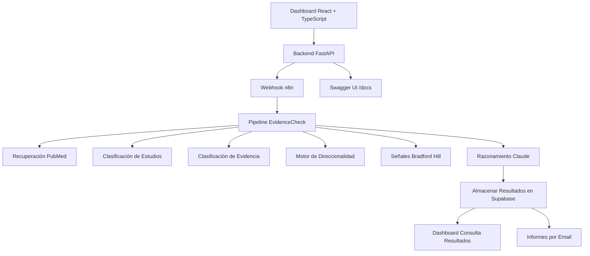

# 🧬 EvidenceCheck AI
# Razonamiento Estructurado de Evidencia Biomédica

EvidenceCheck AI es una plataforma de análisis de evidencia biomédica impulsada por IA, diseñada para evaluar afirmaciones sobre salud y nutrición mediante recuperación de literatura científica, razonamiento estructurado de evidencia e inferencia causal.

A diferencia de los sistemas tradicionales de resumen con IA, EvidenceCheck construye un modelo de evidencia estructurado antes de generar conclusiones. La plataforma recupera literatura de PubMed, clasifica diseños de estudios, evalúa la calidad metodológica, analiza la direccionalidad de la evidencia, detecta contradicciones, analiza la especificidad de las afirmaciones, incorpora señales causales de Bradford Hill y genera veredictos basados en evidencia.

Desarrollado como una plataforma real de verificación de evidencia biomédica.


[](https://n8n.io/)
[](https://ai.google.dev/)
[](https://pubmed.ncbi.nlm.nih.gov/)
[](https://react.dev/)
[](https://www.typescriptlang.org/)
[](https://fastapi.tiangolo.com/)
[](https://www.postgresql.org/)


[](https://vitest.dev/)
[](LICENSE)

---

## 🎯 ¿Qué lo hace diferente?

EvidenceCheck está diseñado para razonar sobre evidencia científica en lugar de simplemente resumir artículos científicos.

Muchos sistemas de verificación de hechos con IA recuperan artículos científicos y piden a un modelo de lenguaje que genere un resumen.

EvidenceCheck introduce una capa de razonamiento estructurado de evidencia biomédica que evalúa:

* Calidad del diseño del estudio
* Solidez metodológica
* Direccionalidad de la evidencia
* Consenso científico
* Especificidad de la afirmación
* Posibles conflictos de interés
* Señales causales de Bradford Hill

antes de generar un veredicto.

Esto permite al sistema distinguir entre:

* Soporte directo
* Soporte parcial
* Falta de soporte
* Evidencia contradictoria
* Evidencia mixta
* Afirmaciones sobregeneralizadas
* Sobreestimación causal
* Insuficiencia genuina de evidencia

Al introducir razonamiento estructurado de evidencia antes del análisis de IA, EvidenceCheck busca reducir los fallos comunes en sistemas genéricos de verificación con LLM, incluyendo:

* Tratar la ausencia de evidencia como evidencia en contra
* Confundir evidencia débil con evidencia contradictoria
* Sobreestimar conclusiones causales
* Clasificar incorrectamente afirmaciones absolutas
* Ignorar diferencias entre diseños de estudios
* Aplicar estándares de evidencia poco realistas cuando los ensayos aleatorios no son éticamente viables

---

## 📋 Ejemplo de Análisis

### Afirmación

> "La vitamina D previene las fracturas en adultos mayores"

### Resultado

| Métrica | Valor |
|----------|----------|
| Veredicto | PARCIALMENTE VERDADERO |
| Confianza | MODERADA |
| Consenso | MIXTO |

### Razonamiento

La evidencia sugiere que la vitamina D puede ayudar a prevenir fracturas en poblaciones específicas, particularmente cuando se combina con calcio y en personas con deficiencia o perfiles de mayor riesgo.

Sin embargo, el efecto no es consistente en todas las poblaciones. Algunos ensayos controlados aleatorios y metaanálisis han encontrado beneficios limitados o nulos en adultos mayores sanos que viven en la comunidad.

Por lo tanto, la afirmación no puede considerarse universalmente verdadera y depende de las características de la población, el estado de deficiencia basal y la estrategia de suplementación.

### Señales de Evidencia

- Dirección de la evidencia: Mixta
- Fuerza del consenso: Mixta
- Dependencia del contexto: Alta
- Sobregeneralización de la afirmación: Detectada

---

## 🖼️ Capturas de Pantalla

### Vista General del Dashboard


### Lista de Análisis


### Análisis Detallado


### Informe por Email


### Vista General del Pipeline


---

## 🚀 Características Principales

- 🔬 Análisis automático de afirmaciones biomédicas
- 📚 Recuperación de literatura científica de PubMed
- 🏆 Motor de clasificación de evidencia
- 🧬 Clasificación de diseños de estudios
- 📊 Puntuación de calidad metodológica
- ⚖️ Motor de direccionalidad (soporta, contradice, no soporta)
- 🎯 Análisis de especificidad de afirmaciones
- 📈 Consenso de evidencia ponderado
- 🧪 Señales de inferencia causal de Bradford Hill
- 🛡️ Detección de conflictos de interés
- 🚫 Razonamiento anti-sobreestimación para afirmaciones absolutas
- 🧠 Razonamiento científico impulsado por Claude
- 📊 Dashboard interactivo con React + TypeScript
- 🐍 Backend FastAPI con endpoints REST
- 🗄️ Arquitectura SQLite (n8n) + Supabase (resultados)
- 🗄️ Arquitectura de trabajos asíncronos con PostgreSQL
- 📧 Informes automáticos por email
- 🧪 26 tests pasando con Vitest
- 📚 Documentación interactiva de la API (Swagger UI)

---

## 🌍 Casos de Uso Potenciales

* Verificación de desinformación sobre salud
* Evaluación de afirmaciones nutricionales
* Verificación de hechos científicos
* Asistencia en investigación biomédica
* Soporte para decisiones basadas en evidencia
* Revisión de contenido sanitario
* Demostraciones educativas de sistemas de análisis de evidencia

---

## 🧠 Capacidades de Razonamiento de Evidencia

EvidenceCheck realiza múltiples capas de análisis de evidencia antes del razonamiento con IA:

### Recuperación de Evidencia

- Generación de consultas PubMed
- Descomposición de afirmaciones
- Extracción de exposición y resultado
- Recuperación de literatura científica

### Clasificación de Evidencia

- Identificación del diseño del estudio
- Detección de metaanálisis
- Detección de revisiones sistemáticas
- Identificación de estudios de cohortes
- Clasificación de ensayos clínicos
- Evaluación del nivel de resultados

### Evaluación de Evidencia

- Puntuación de calidad metodológica
- Puntuación de relevancia
- Análisis de especificidad de exposición
- Puntuación de centralidad de la afirmación
- Ponderación de la jerarquía de resultados

### Razonamiento sobre Evidencia

- Detección de direccionalidad
- Análisis de contradicciones
- Generación de consenso ponderado
- Evaluación de especificidad de la afirmación
- Evaluación de conflictos de interés
- Señales de inferencia causal de Bradford Hill

### Informes Científicos

- Generación de veredictos basados en evidencia
- Estimación de confianza
- Evaluación del consenso
- Explicaciones científicas estructuradas

---

## 🔬 Motor de Razonamiento Estructurado de Evidencia

EvidenceCheck no simplemente resume resúmenes de PubMed.

Antes del razonamiento con IA, la plataforma construye un modelo de evidencia estructurado que incluye:

- Clasificación del diseño del estudio
- Evaluación de la calidad metodológica
- Puntuación de relevancia
- Análisis de direccionalidad de la evidencia
- Cálculo de consenso ponderado
- Evaluación de especificidad de la afirmación
- Señales de conflicto de interés
- Señales de inferencia causal de Bradford Hill

Esta arquitectura permite al sistema distinguir entre:

- Soporte directo
- Soporte parcial
- Falta de soporte
- Evidencia contradictoria
- Evidencia mixta
- Afirmaciones sobregeneralizadas
- Sobreestimación causal
- Insuficiencia genuina de evidencia

El objetivo es reducir los fallos comunes observados en sistemas genéricos de verificación con LLM.

---

## 🏗️ Arquitectura del Sistema


> **Nota arquitectónica:** n8n utiliza SQLite como base de datos interna para la configuración del sistema, ejecuciones y credenciales. EvidenceCheck utiliza PostgreSQL/Supabase como capa de persistencia de negocio para jobs, claims, resultados y consultas realizadas por los workflows.
---

## ⚙️ Workflows Principales

| Workflow | Propósito |
| ---------------------- | ---------------------------------- |
| Submit Analysis Job | Crea trabajos de análisis asíncronos |
| EvidenceCheck Pipeline | Análisis completo de evidencia biomédica |
| Get Job Result | Recupera análisis completados |
| List Jobs | Listado de trabajos en el dashboard |

---

## 🛠️ Stack Tecnológico

| Tecnología | Propósito |
|------------|---------|
| FastAPI | API Backend (endpoints REST) |
| TypeScript | Tipado seguro en frontend |
| Vitest | Tests unitarios (26 tests) |
| n8n | Orquestación de workflows |
| Claude | Razonamiento científico |
| PubMed | Recuperación de literatura |
| SQLite | Almacenamiento local de n8n |
| Supabase | Persistencia de resultados |
| React | Interfaz del dashboard |
| Vite | Herramientas de frontend |
| Recharts | Análisis y visualización |
| Gmail | Informes automáticos por email |
| Framework Bradford Hill | Evaluación de inferencia causal |

---

## 📂 Estructura del Proyecto

```text
EvidenceCheck-AI/
│
├── README.md
├── README_ES.md
├── LICENSE
├── .env.example
│
├── backend/                    # Backend FastAPI
│   ├── main.py                 # Endpoints de la API
│   ├── requirements.txt        # Dependencias Python
│   └── venv/                   # Entorno virtual
│
├── workflows/
│   ├── EvidenceCheck_API_Submit_Analysis_Job.json
│   ├── EvidenceCheck_AI_Pipeline_Principal_Claude.json
│   ├── EvidenceCheck_Get_Job_Result.json
│   └── EvidenceCheck_List_Jobs.json
│
├── database/
│   └── schema.sql
│
├── dashboard/
│   ├── src/                    # Código fuente TypeScript
│   │   ├── App.tsx             # Componente principal
│   │   ├── App.test.tsx        # Tests
│   │   └── *.test.ts           # 26 tests unitarios
│   ├── vitest.config.ts        # Configuración Vitest
│   ├── package.json
│   └── vite.config.js
│
└── screenshots/
    ├── dashboard-home.png
    ├── analysis-list.png
    ├── analysis-detail.png
    ├── email-report.png
    └── architecture-pipeline.png
```
---

## 🎥 Vídeo Demo

Una demostración corta que muestra:

* Envío de afirmaciones
* Recuperación de evidencia
* Análisis científico
* Visualización en el dashboard
* Evaluación del consenso de evidencia
* Generación del informe final

Vídeo Demo en LinkedIn:

[Ver Vídeo Demo](https://www.linkedin.com/feed/update/urn:li:activity:7466543078049206273/)

---

## 🚀 Instalación

### 1. Requisitos

* n8n
* PostgreSQL 13+
* Python 3.12+
* Clave API de Anthropic
* Cuenta Gmail (opcional)
* Node.js 20+

### 2. Configurar Backend FastAPI

```bash
cd backend
python -m venv venv
source venv/bin/activate  # o: venv\Scripts\activate (Windows)
pip install -r requirements.txt
uvicorn main:app --reload --port 8000
```

### 3. Importar Workflows

En n8n:

```text
Menú → Importar desde archivo
```

Importa todos los workflows de la carpeta `workflows/`.

### 4. Configurar Variables de Entorno

Crea el archivo `.env` en la carpeta `backend/`:

```env
N8N_WEBHOOK=https://n8n.tudominio.com/webhook/evidence-check-submit
N8N_JOBS_URL=https://n8n.tudominio.com/webhook/evidence-check-jobs
N8N_RESULT_URL=https://n8n.tudominio.com/webhook/tu-webhook-id/evidence-check-result
```

Para n8n, crea `.env` en la carpeta `n8n/`:

```env
DB_PASSWORD=
N8N_ENCRYPTION_KEY=
```

y configura los valores requeridos.

### 5. Ejecutar el Dashboard

```bash
cd dashboard

npm install

npm run dev
```

### 6. Acceder al Sistema

| Servicio | URL |
|---------|-----|
| Dashboard | http://localhost:5173 |
| FastAPI Swagger UI | http://localhost:8000/docs |
| FastAPI API | http://localhost:8000 |
| n8n | https://n8n.tudominio.com |

---

## 🔐 Variables de Entorno

```env
ANTHROPIC_API_KEY=

POSTGRES_HOST=
POSTGRES_PORT=
POSTGRES_DB=
POSTGRES_USER=
POSTGRES_PASSWORD=

EVIDENCECHECK_PIPELINE_URL=

VITE_EVIDENCECHECK_API_BASE=
VITE_EVIDENCECHECK_LIST_JOBS_PATH=
VITE_EVIDENCECHECK_SUBMIT_JOB_PATH=
VITE_EVIDENCECHECK_RESULT_JOB_PATH=
```

---

## 📊 Funcionalidades del Dashboard

* Enviar nuevas afirmaciones biomédicas
* Seguimiento del estado de trabajos en tiempo real
* Visualización del consenso de evidencia
* Análisis de distribución de veredictos
* Desglose detallado de evidencia
* Inspección de artículos científicos
* Búsqueda y filtrado
* Gráficos interactivos de balance de evidencia
* Bilingüe (ES/EN)
* Tipado seguro con TypeScript

---

## 🔬 Pipeline de Análisis

La plataforma realiza un proceso de evaluación de evidencia en múltiples etapas:

1. Normalización de la afirmación
2. Descomposición de la afirmación
3. Extracción de exposición y resultado
4. Generación de consulta PubMed
5. Recuperación de literatura científica
6. Clasificación del diseño del estudio
7. Puntuación de calidad metodológica
8. Clasificación por relevancia
9. Detección de direccionalidad
10. Análisis de conflictos de interés
11. Generación de consenso ponderado
12. Análisis de especificidad de la afirmación
13. Evaluación causal de Bradford Hill
14. Detección de contradicciones
15. Razonamiento científico con Claude
16. Generación del informe en el dashboard
17. Persistencia de resultados
18. Generación de informe por email

---

## 🧪 Testing

Ejecutar los tests del dashboard:

```bash
cd dashboard
npm run test
```

Los tests cubren:

* Normalización de veredictos
* Normalización del consenso
* Clases de badges
* Estilos de tarjetas
* Cálculo de KPIs
* Filtrado de búsqueda
* Formato de tiempo
* Traducciones

---

## 🛡️ Seguridad

* No subas archivos `.env`
* No escribas credenciales en el código
* Usa variables de entorno
* Elimina credenciales antes de exportar workflows
* Elimina IDs de webhooks antes de publicar
* Sanitiza las exportaciones de workflows antes de publicar en GitHub
* Mantén las claves API de Anthropic en privado
* Usa credenciales separadas por entorno

---

## 🗺️ Hoja de Ruta

### ✅ Completado
- Integración del backend FastAPI
- Migración a TypeScript
- 26 tests pasando con Vitest
- Dashboard bilingüe (ES/EN)
- Documentación interactiva de la API (Swagger UI)

### 🔄 Planificado
- Integración con Cochrane
- Fuentes de evidencia de la OMS
- Integración de guías NICE
- Autenticación de usuarios
- Seguimiento histórico de evidencia
- API pública
- Visualización avanzada de evidencia
- Soporte multiusuario
- ClinicalTrials.gov
- Razonamiento basado en guías clínicas
- Análisis de línea temporal de evidencia

---

## ⚠️ Aviso Legal

Este repositorio contiene una versión de demostración pública destinada a fines educativos y de portfolio.

Los análisis científicos generados por el sistema no deben considerarse consejo médico.

Consulta siempre a profesionales sanitarios cualificados para decisiones médicas.

---

## 📄 Licencia

Licencia MIT.

---

## 👤 Autor

**Alejandro Peralta**

Automatización de Procesos y Sistemas de IA

* GitHub: https://github.com/alejandro-orbis
* LinkedIn: https://linkedin.com/in/alejandro-orbis

---

Desarrollado para explorar el análisis escalable de evidencia biomédica usando IA, recuperación de literatura científica y automatización moderna de workflows.
