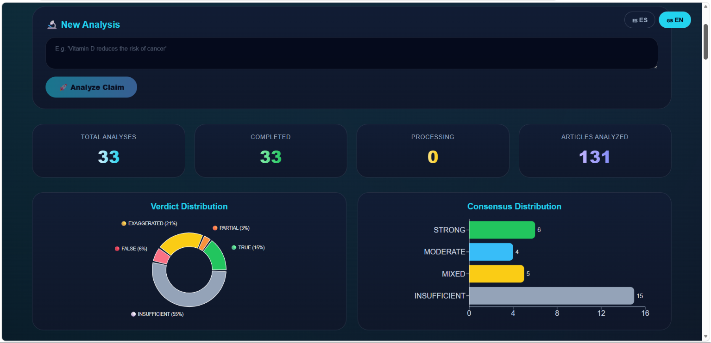
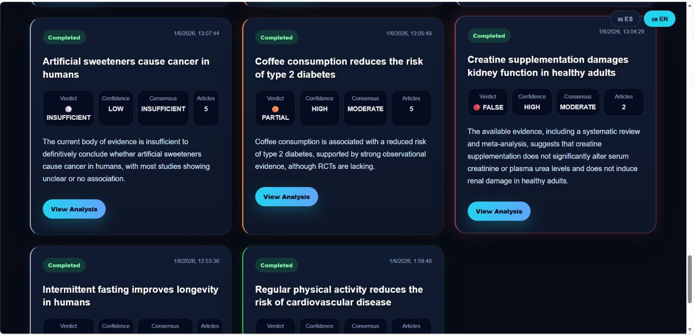
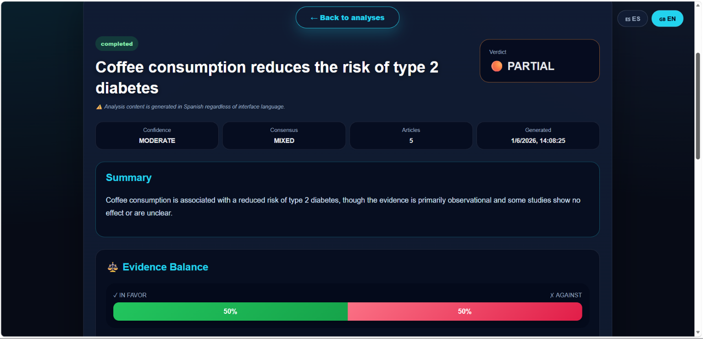
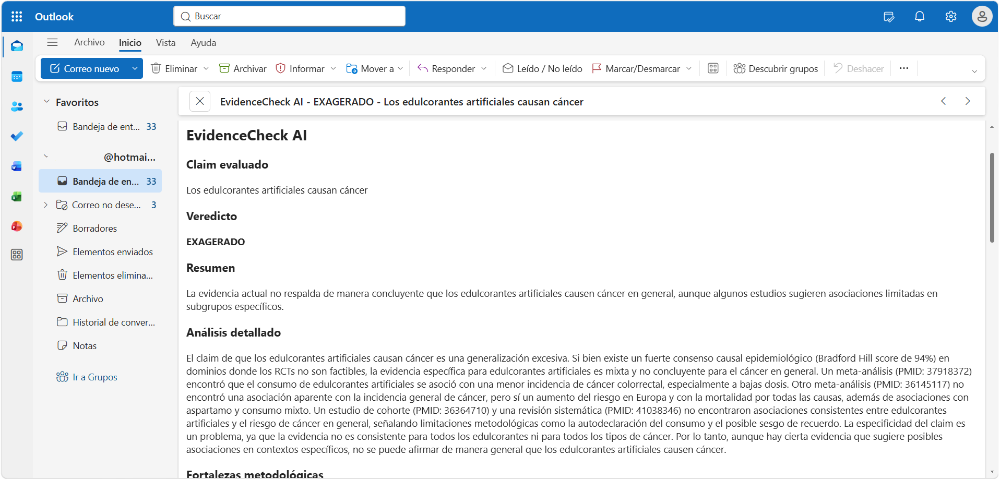
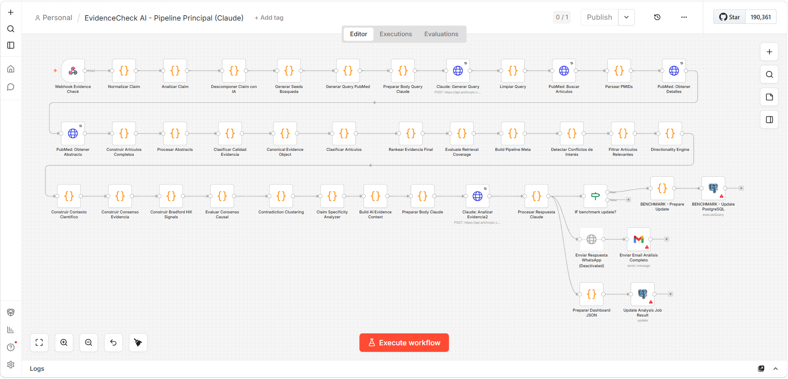
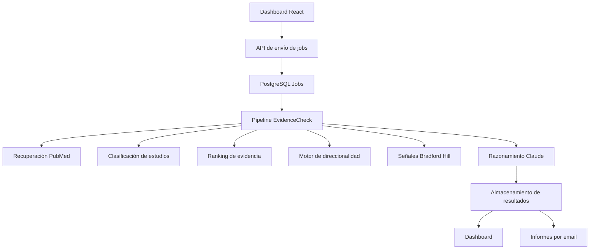

# 🧬 EvidenceCheck AI
# Razonamiento Estructurado sobre Evidencia Biomédica

EvidenceCheck AI es una plataforma de análisis de evidencia biomédica impulsada por IA, diseñada para evaluar afirmaciones sobre salud y nutrición mediante recuperación de literatura científica, razonamiento estructurado sobre evidencia e inferencia causal.

A diferencia de los sistemas tradicionales de resumen con IA, EvidenceCheck construye un modelo de evidencia estructurado antes de generar conclusiones. La plataforma recupera literatura de PubMed, clasifica diseños de estudio, evalúa la calidad metodológica, analiza la direccionalidad de la evidencia, detecta contradicciones, analiza la especificidad del claim, incorpora señales causales de Bradford Hill y genera veredictos basados en evidencia.

Construido como una plataforma real de verificación de evidencia biomédica.



[](https://n8n.io/)
[](https://anthropic.com)
[](https://pubmed.ncbi.nlm.nih.gov/)
[](https://react.dev/)
[](https://www.postgresql.org/)


[](LICENSE)

---

## 🎯 ¿Qué hace diferente a este proyecto?

EvidenceCheck está diseñado para razonar sobre evidencia científica, no simplemente para resumir artículos científicos.

Muchos sistemas de verificación de hechos con IA recuperan artículos científicos y piden a un modelo de lenguaje que genere un resumen.

EvidenceCheck introduce una capa de razonamiento estructurado sobre evidencia biomédica que evalúa:

* Calidad del diseño de estudio
* Solidez metodológica
* Direccionalidad de la evidencia
* Consenso científico
* Especificidad del claim
* Posibles conflictos de interés
* Señales causales de Bradford Hill

antes de generar un veredicto.

Esto permite al sistema distinguir entre:

* Apoyo directo
* Apoyo parcial
* Falta de apoyo
* Evidencia contradictoria
* Evidencia mixta
* Claims sobregeneralizados
* Sobreafirmación causal
* Insuficiencia genuina de evidencia

Al introducir razonamiento estructurado sobre evidencia antes del análisis con IA, EvidenceCheck busca reducir los fallos comunes presentes en los sistemas genéricos de verificación basados en LLMs, incluyendo:

* Tratar la ausencia de evidencia como evidencia en contra
* Confundir evidencia débil con evidencia contradictoria
* Sobreafirmar conclusiones causales
* Clasificar incorrectamente claims absolutos
* Ignorar diferencias entre diseños de estudio
* Aplicar estándares de evidencia poco realistas cuando los ensayos aleatorizados no son éticamente viables

---

## 📋 Ejemplo de análisis

### Afirmación

> "La vitamina D previene fracturas en adultos mayores"

### Resultado

| Métrica | Valor |
|---------|-------|
| Veredicto | PARCIALMENTE CIERTO |
| Confianza | MODERADA |
| Consenso | MIXTO |

### Razonamiento

La evidencia sugiere que la vitamina D puede ayudar a prevenir fracturas en poblaciones específicas, especialmente cuando se combina con calcio y en personas con deficiencia o perfiles de mayor riesgo.

Sin embargo, el efecto no es consistente en todas las poblaciones. Algunos ensayos controlados aleatorizados y meta-análisis han encontrado un beneficio limitado o nulo en adultos mayores sanos que viven en comunidad.

Por ello, el claim no puede considerarse universalmente verdadero y depende de las características de la población, el estado basal de deficiencia y la estrategia de suplementación.

### Señales de evidencia

- Direccionalidad de la evidencia: Mixta
- Solidez del consenso: Mixta
- Dependencia del contexto: Alta
- Sobregeneralización del claim: Detectada

---

## 🖼️ Capturas de pantalla

### Vista general del dashboard


### Lista de análisis



### Análisis detallado



### Informe por email



### Vista general del pipeline



---

## 🚀 Características principales

- 🔬 Análisis automatizado de afirmaciones biomédicas
- 📚 Recuperación de literatura científica desde PubMed
- 🏆 Motor de ranking de evidencia
- 🧬 Clasificación de diseños de estudio
- 📊 Puntuación de calidad metodológica
- ⚖️ Motor de direccionalidad (apoya, contradice, no apoya)
- 🎯 Análisis de especificidad del claim
- 📈 Consenso de evidencia ponderado
- 🧪 Señales de inferencia causal de Bradford Hill
- 🛡️ Detección de conflictos de interés
- 🚫 Razonamiento anti-sobreafirmación para claims absolutos
- 🧠 Razonamiento científico impulsado por Claude
- 📊 Dashboard interactivo en React
- 🗄️ Arquitectura de jobs asíncronos con PostgreSQL
- 📧 Informes automáticos por email

---

## 🌍 Casos de uso potenciales

* Verificación de desinformación en salud
* Evaluación de claims nutricionales
* Verificación de hechos científicos
* Asistencia en investigación biomédica
* Soporte para toma de decisiones basada en evidencia
* Revisión de contenido sanitario
* Demostraciones educativas de sistemas de análisis de evidencia

---

## 🧠 Capacidades de razonamiento sobre evidencia

EvidenceCheck realiza múltiples capas de análisis de evidencia antes del razonamiento con IA:

### Recuperación de evidencia

- Generación de queries para PubMed
- Descomposición del claim
- Extracción de exposición y outcomes
- Recuperación de literatura científica

### Clasificación de evidencia

- Identificación del diseño de estudio
- Detección de meta-análisis
- Detección de revisiones sistemáticas
- Identificación de estudios de cohorte
- Clasificación de ensayos clínicos
- Evaluación de la jerarquía de outcomes

### Evaluación de evidencia

- Puntuación de calidad metodológica
- Puntuación de relevancia
- Análisis de especificidad de la exposición
- Puntuación de centralidad del claim
- Ponderación de la jerarquía de outcomes

### Razonamiento sobre evidencia

- Detección de direccionalidad
- Análisis de contradicciones
- Generación de consenso ponderado
- Evaluación de especificidad del claim
- Evaluación de conflictos de interés
- Señales de inferencia causal de Bradford Hill

### Generación de informes científicos

- Generación de veredictos basados en evidencia
- Estimación de confianza
- Evaluación del consenso
- Explicaciones científicas estructuradas

---

## 🔬 Motor de razonamiento estructurado sobre evidencia

EvidenceCheck no se limita a resumir abstracts de PubMed.

Antes del razonamiento con IA, la plataforma construye un modelo de evidencia estructurado que incluye:

- Clasificación del diseño de estudio
- Evaluación de la calidad metodológica
- Puntuación de relevancia
- Análisis de la direccionalidad de la evidencia
- Cálculo del consenso ponderado
- Evaluación de la especificidad del claim
- Señales de conflictos de interés
- Señales de inferencia causal de Bradford Hill

Esta arquitectura permite al sistema distinguir entre:

- Apoyo directo
- Apoyo parcial
- Falta de apoyo
- Evidencia contradictoria
- Evidencia mixta
- Claims sobregeneralizados
- Sobreafirmación causal
- Insuficiencia genuina de evidencia

El objetivo es reducir los fallos comunes observados en los sistemas genéricos de verificación basados en LLMs.

---

## 🏗️ Arquitectura del sistema



---

## ⚙️ Workflows principales

| Workflow                    | Propósito                                      |
| --------------------------- | ---------------------------------------------- |
| Submit Analysis Job         | Crea jobs de análisis asíncronos               |
| EvidenceCheck Pipeline      | Análisis completo de evidencia biomédica       |
| Get Job Result              | Recupera análisis completados                  |
| List Jobs                   | Listado de jobs para el dashboard              |

---

## 🛠️ Stack tecnológico

| Tecnología | Propósito |
|------------|-----------|
| n8n | Orquestación de workflows |
| Claude | Razonamiento científico |
| PubMed | Recuperación de literatura |
| PostgreSQL | Almacenamiento asíncrono de jobs |
| React | Interfaz del dashboard |
| Vite | Herramientas de frontend |
| Recharts | Analítica y visualización |
| Gmail | Informes automáticos de evidencia |
| Marco Bradford Hill | Evaluación de inferencia causal |

---

## 📂 Estructura del proyecto

```text
EvidenceCheck-AI/
│
├── README.md
├── README_ES.md
├── LICENSE
├── .env.example
│
├── workflows/
│   ├── EvidenceCheck_API_Submit_Analysis_Job.json
│   ├── EvidenceCheck_AI_Pipeline_Principal_Claude.json
│   ├── EvidenceCheck_Get_Job_Result.json
│   └── EvidenceCheck_List_Jobs.json
│
├── database/
│   └── schema.sql
│
├── dashboard/
│   ├── src/
│   ├── package.json
│   └── vite.config.js
│
└── screenshots/
    ├── dashboard-home.png
    ├── analysis-list.png
    ├── analysis-detail.png
    ├── email-report.png
    └── architecture-pipeline.png
```

---

## 🎥 Vídeo de demostración

Un breve recorrido que muestra:

* Envío de un claim
* Recuperación de evidencia
* Análisis científico
* Visualización en el dashboard
* Evaluación del consenso de evidencia
* Generación del informe final

Vídeo de demostración en LinkedIn:

[Vídeo Demo]([YOUR_LINKEDIN_VIDEO_URL](https://www.linkedin.com/feed/update/urn:li:activity:7466543078049206273/))

---

## 🚀 Instalación

### 1. Requisitos

* n8n
* PostgreSQL 13+
* API Key de Anthropic
* Cuenta de Gmail (opcional)
* Node.js 20+

### 2. Configurar la base de datos

```bash
psql -U postgres -f database/schema.sql
```

### 3. Importar workflows

En n8n:

```text
Menú → Importar desde archivo
```

Importa todos los workflows de la carpeta `workflows/`.

### 4. Configurar variables de entorno

Copia:

```bash
cp .env.example .env
```

y configura los valores necesarios.

### 5. Ejecutar el dashboard

```bash
cd dashboard

npm install

npm run dev
```

---

## 🔐 Variables de entorno

```env
ANTHROPIC_API_KEY=

POSTGRES_HOST=
POSTGRES_PORT=
POSTGRES_DB=
POSTGRES_USER=
POSTGRES_PASSWORD=

EVIDENCECHECK_PIPELINE_URL=

VITE_EVIDENCECHECK_API_BASE=
VITE_EVIDENCECHECK_LIST_JOBS_PATH=
VITE_EVIDENCECHECK_SUBMIT_JOB_PATH=
VITE_EVIDENCECHECK_RESULT_JOB_PATH=
```

---

## 📊 Funcionalidades del dashboard

* Envío de nuevos claims biomédicos
* Seguimiento del estado de jobs en tiempo real
* Visualización del consenso de evidencia
* Analítica de distribución de veredictos
* Desglose detallado de evidencia
* Inspección de artículos científicos
* Búsqueda y filtrado
* Gráficos interactivos de balance de evidencia

---

## 🔬 Pipeline de análisis

La plataforma realiza un proceso de evaluación de evidencia en múltiples etapas:

1. Normalización del claim
2. Descomposición del claim
3. Extracción de exposición y outcomes
4. Generación de query para PubMed
5. Recuperación de literatura científica
6. Clasificación del diseño de estudio
7. Puntuación de calidad metodológica
8. Ranking de relevancia
9. Detección de direccionalidad
10. Análisis de conflictos de interés
11. Generación de consenso ponderado
12. Análisis de especificidad del claim
13. Evaluación causal con Bradford Hill
14. Detección de contradicciones
15. Razonamiento científico con Claude
16. Generación del informe para el dashboard
17. Persistencia del resultado
18. Generación del informe por email

---

## 🛡️ Seguridad

* No subas archivos `.env`
* No escribas credenciales directamente en el código
* Usa variables de entorno
* Elimina las credenciales antes de exportar workflows
* Elimina los IDs de webhooks antes de publicar
* Sanea los exports de workflows antes de publicar en GitHub
* Mantén las API keys de Anthropic en privado
* Usa credenciales separadas por entorno

---

## 🗺️ Hoja de ruta

* Integración con Cochrane
* Fuentes de evidencia de la OMS
* Integración con guías NICE
* Dashboard multilingüe
* Autenticación de usuarios
* Seguimiento histórico de evidencia
* API pública
* Visualización avanzada de evidencia
* Soporte multiusuario
* ClinicalTrials.gov
* Razonamiento basado en guías clínicas
* Análisis de línea temporal de evidencia

---

## ⚠️ Aviso legal

Este repositorio contiene una versión de demostración pública destinada a fines educativos y de portfolio.

Los análisis científicos generados por el sistema no deben considerarse consejo médico.

Consulta siempre con profesionales sanitarios cualificados para tomar decisiones médicas.

---

## 📄 Licencia

Licencia MIT.

---

## 👤 Autor

**Alejandro Peralta**

Automatización de Procesos y Sistemas de IA

* GitHub: https://github.com/alejandro-orbis
* LinkedIn: https://linkedin.com/in/alejandro-orbis

---

Construido para explorar el análisis escalable de evidencia biomédica usando IA, recuperación de literatura científica y automatización moderna de workflows.
