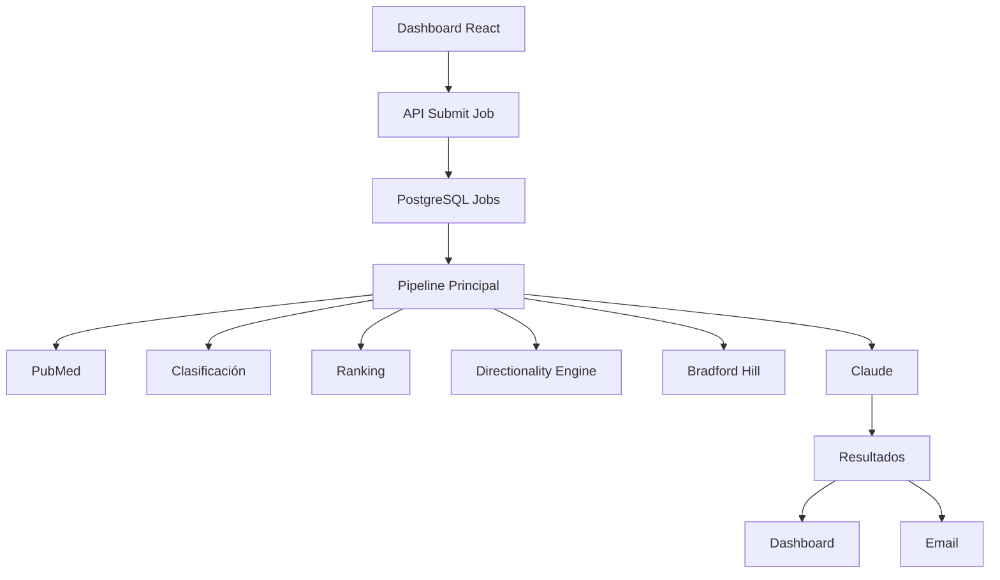

# 🧬 EvidenceCheck AI - Plataforma de Análisis Biomédico Basado en Evidencia

EvidenceCheck AI es una plataforma de análisis biomédico impulsada por inteligencia artificial diseñada para evaluar afirmaciones sobre salud y nutrición utilizando recuperación de literatura científica, razonamiento estructurado sobre evidencia y evaluación causal.

A diferencia de los sistemas tradicionales que simplemente resumen artículos científicos, EvidenceCheck construye un modelo estructurado de evidencia antes de generar conclusiones. La plataforma recupera literatura de PubMed, clasifica diseños de estudio, evalúa calidad metodológica, analiza la dirección de la evidencia, detecta contradicciones, estudia la especificidad de los claims e incorpora señales causales basadas en Bradford Hill para generar veredictos fundamentados.

Construido como una plataforma real de verificación biomédica basada en evidencia científica.


---

## 🎯 ¿Qué hace diferente a EvidenceCheck?

EvidenceCheck está diseñado para razonar sobre evidencia científica en lugar de limitarse a resumir artículos.

Muchos sistemas de fact-checking basados en IA recuperan artículos científicos y solicitan a un modelo de lenguaje que genere un resumen.

EvidenceCheck introduce una capa estructurada de razonamiento biomédico que evalúa:

- Calidad del diseño de estudio
- Fortaleza metodológica
- Direccionalidad de la evidencia
- Consenso científico
- Especificidad del claim
- Posibles conflictos de interés
- Señales causales de Bradford Hill

antes de generar un veredicto.

Esto permite distinguir entre:

- Apoyo directo
- Apoyo parcial
- Ausencia de apoyo
- Evidencia contradictoria
- Consenso mixto
- Claims sobre-generalizados
- Sobreafirmaciones causales
- Insuficiencia real de evidencia

---

## 📋 Ejemplo de análisis

### Claim

> "La vitamina D previene fracturas en adultos mayores"

### Resultado

| Métrica | Valor |
|----------|----------|
| Veredicto | PARCIALMENTE_CIERTO |
| Confianza | MODERATE |
| Consenso | MIXED |

### Razonamiento

La evidencia sugiere que la vitamina D puede ayudar a prevenir fracturas en poblaciones específicas, especialmente cuando se combina con calcio y en personas con déficit o mayor riesgo.

Sin embargo, el efecto no es consistente en todas las poblaciones. Algunos ensayos clínicos aleatorizados y meta-análisis muestran beneficios limitados o inexistentes en adultos mayores sanos que viven en la comunidad.

Por ello, el claim no puede considerarse universalmente verdadero y depende del contexto clínico y poblacional.

---

## 🖼️ Capturas de pantalla

### Dashboard


### Lista de análisis


### Análisis detallado


### Informe por email


### Pipeline


---

## 🎥 Vídeo demostración

Añade aquí el enlace a tu vídeo de LinkedIn.

---

## 🚀 Características principales

- Análisis automatizado de claims biomédicos
- Recuperación de literatura científica desde PubMed
- Motor de ranking de evidencia
- Clasificación de diseños de estudio
- Evaluación metodológica
- Motor de direccionalidad
- Análisis de especificidad de claims
- Consenso científico ponderado
- Señales causales de Bradford Hill
- Detección de conflictos de interés
- Dashboard React
- Arquitectura asíncrona basada en jobs
- Informes automáticos por email

---

## 🧠 Motor de razonamiento sobre evidencia

EvidenceCheck realiza múltiples capas de análisis antes de generar conclusiones:

1. Descomposición del claim
2. Generación de consultas científicas
3. Recuperación de literatura
4. Clasificación de estudios
5. Evaluación metodológica
6. Ranking de evidencia
7. Análisis de direccionalidad
8. Detección de contradicciones
9. Consenso ponderado
10. Análisis de especificidad
11. Evaluación causal (Bradford Hill)
12. Razonamiento científico con Claude

---

## 🏗️ Arquitectura



---

## 🛠️ Stack tecnológico

- n8n
- Claude
- PubMed
- PostgreSQL
- React
- Vite
- Recharts
- Gmail

---

## 📂 Estructura del proyecto

```text
EvidenceCheck-AI/
├── workflows/
├── database/
│   └── schema.sql
├── dashboard/
├── screenshots/
├── .env.example
├── README.md
└── README_ES.md
```

---

## 🔐 Seguridad

- Variables de entorno para credenciales
- Workflows sanitizados antes de publicar
- Sin claves API en el repositorio
- Sin datos de producción
- Sin credenciales exportadas

---

## 🗺️ Roadmap

- Integración con Cochrane
- Integración con WHO
- Integración con NICE
- ClinicalTrials.gov
- Dashboard multilenguaje
- API pública
- Historial de evidencia
- Autenticación de usuarios

---

## ⚠️ Descargo de responsabilidad

Este proyecto se publica con fines educativos y de portfolio.

Los análisis generados no constituyen consejo médico y no deben sustituir el criterio de profesionales sanitarios cualificados.

---

## 📄 Licencia

MIT License.

---

## 👤 Autor

Alejandro Peralta

GitHub: https://github.com/alejandro-orbis
LinkedIn: https://linkedin.com/in/alejandro-orbis
